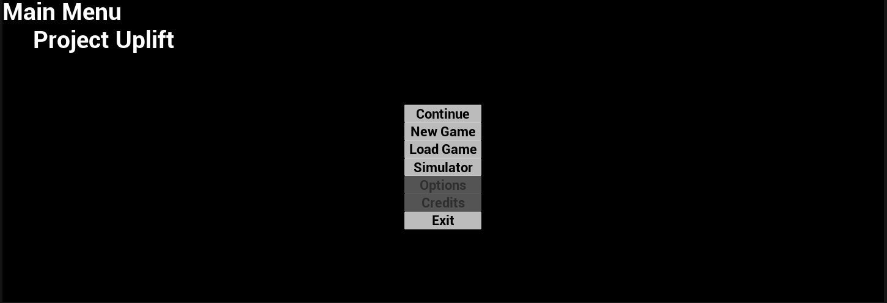
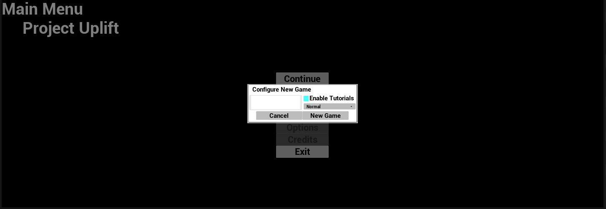
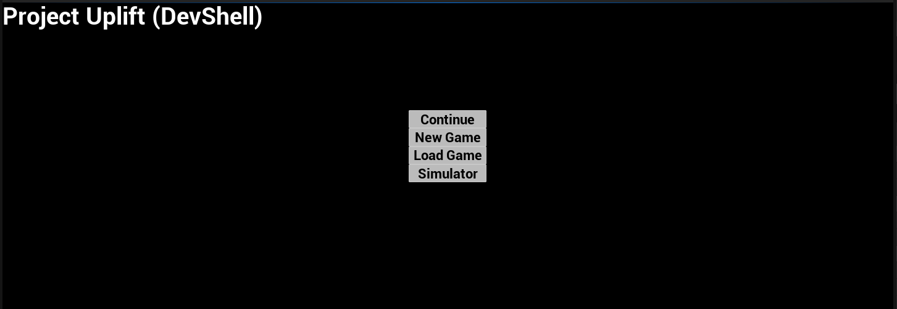
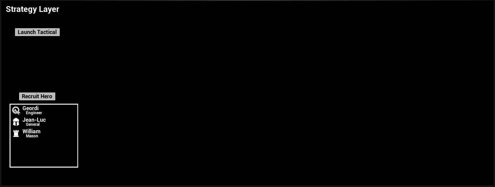
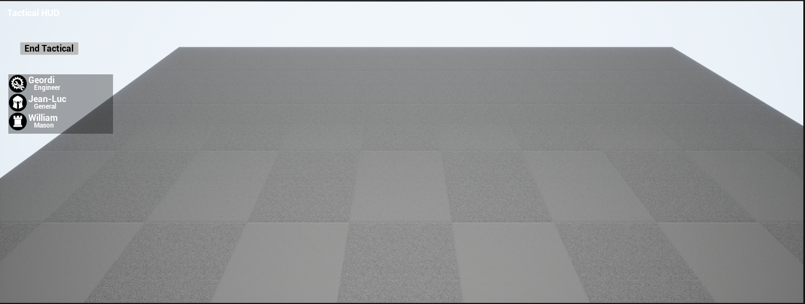
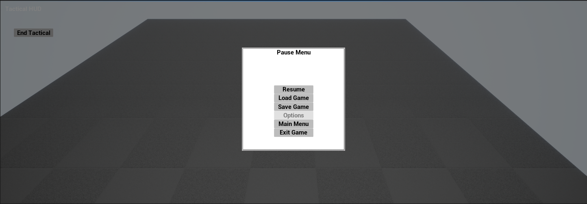

# Project Uplift

An example project tying together the use of plugins from my own Starfire repository.

## Detailed Description

Uplift is an example project similar to Epic's Lyra. It's intent is to demonstrate a couple of things.

The first is the use of my own Starfire plugins to show how they can be used in a concrete way and how they might be used together in ways that may not be obvious looking at each one on it's own.

The second is to demonstrate certain project side patterns that can only exist in a project and is not functionality easily placed in a plugin for reuse.

The game itself doesn't have a detailed design, but is a little more of a playground. But there are a few known bits to narrow some of the possible scope:
* Single Player - I don't mess with MP stuff
* It will have an tactics game (XCom, Fire Emblem, etc) structure with a meta-progression "strategy" layer and a "tactical" gameplay mode that are toggled between in some fashion
* Tactical gameplay will consist of:
	* Some flavor of a Tower Defense-like game ('cause I've wanted to do one for a while)
	* Gameplay swapping between a planning phase where things can be placed and a combat phase where things play out
		* Undecided at this time if there is player interaction during the combat phase
	* Gameplay shouldn't just be the Player on the defensive though, some way to have both/all players with offensive and defensive components
	* The planning phase involving card mechanics to limit available actions ('cause why not)
* Strategy gameplay will consist of:
	* Deckbuilding and modification of various types
	* Character progression
		* Currently thinking both named and randomly generated characters
		* Or maybe all named characters, and some faux-gacha mechanic to build a roster
	* Starting Tactical involves picking X characters which combine their decks for the duration of Tactical
* Feedback in the form of loot, experience, etc from the Tactical gameplay back to the Strategy gameplay

Future plans for this project can be found [here](https://open.codecks.io/starfire/decks/50-uplift), but there is no timeline for when this work may be implemented.
Pull requests that address bugs may be considered, but I'm not interested in PR's for feature implementations

The ReadMe will always reflect the current state of the project that has been uploaded.
A DevLog is available [here](./DevLog.md) which will have a history of updates (summarized) for easy viewing.

### Dependencies

As a demonstration of the Starfire repository plugins, Uplift is dependent on all of them.

It is also dependent on the ModularGameplayActors, CommonGame and CommonUser plugins from Lyra.

However it should be noted that none of these plugins are included in this repository directly.
The plugin code isn't directly relevant to the example code of the project, and is easily accessible if needed.
If you wish to build this project, you will need to source those plugins.

### Starfire Usage

Quick Highlights of how each Starfire Plugin is being used:
* Starfire Game
	* Actor Collections used with the Campaign Mode Scope Collection and children to group actors (primarily persistent ones) that should be deleted prior to the creation of the travel save
	* Game Facts - Implemented by Hero Data Store Actors (currently only contributing the ID tag for the character's Hero Class)
	* Game Feature Subsystems used with Strategy and Tactical world subsystems
	* Level Metadata used with Tactical Map Definition to provide metadata for tactical maps while unloaded
	* Player Modes used in tactical to setup idle Tactical controls. Future modes in tactical to support desired gameplay
	* Starfire Game Core used as the basis for Engine class implementations like Game Instance, Game Mode, Player Controller, etc
* Starfire UI
	* UI Layout configuration
	* Screen & Dialog patterns for gameplay access
	* Actor View Models are used for the underlying management of view models
* Starfire Persistence
	* Data Store Actors for actors that define the game model data. eg DS_Campaign & DS_BattleData for overall campaign and individual tactical instances, generally classes in the DataStoreActors source subdirectory
	* Persistent Actor Archiver used in Campaign Save Game for serializing actor data
* Starfire Save Data
	* Used for Campaign Save Game to support user and level transition saves
* Starfire Messenger
	* Various uses to broadcast gameplay events
	* Campaign game modes broadcast a readiness event
	* A roster event is broadcast when new heroes are added to the active list
	* An event is broadcast in strategy just before the BattleData is destroyed to give strategy systems a chance to update based on any data that may have been returned from Tactical in that Actor
* Starfire Assets
	* Data Definition Library used as custom Asset Manager
	* Data Definition used as the base for all game definition assets, eg Campaign Difficulty Definition
	* Data Definition Extension used for feature extensions of assets in other content directories, eg Campaign Difficulty Extension adding Campaign data to Difficulties in /Game
* Starfire Utilities
	* Splat Task Manager used for Campaign Game Mode initialization over multiple frames without needing to tick the Game Mode Directly
	* Specialized Native Tag macro for gameplay tag declarations scoped to classes
	* Custom Blueprint Async Action class and Exec helper used by save games for blueprint and developer utilities

## Organization

### Game Features

In order to flex the Game Features and make sure they are handled correctly, the entire main/campaign has been configured as a Game Feature Plugin.
The Campaign feature is dedicated to the rules and flow of the game described above. It is intended to have enough content that the game is demonstratably playable.

The Project code & content is focused on the general foundation of the project providing generic tools and project implementations of core Engine classes.
In theory, an entirely unique game (say an FPS) could be created as another Game Feature Plugin and no project code would need to be modified.

There is a second game feature, Simulator, that is for a developer tool for configuring and launching tactical gameplay from the main menu.

### Code

Apart from code being split between the Campaign feature and the project, code is broken up into a number of subdirectories.
Some of these directories are contextual: `Strategy`, `Tactical`, `Shell`, `GameWorld`, while others organize common types like Data Definitions or Actor Collections.

The project creates types that are global to the project, like the Game Instance, as well as creating intermediate abstract types for Engine types, like Game Modes or controllers.
I find it easier to create these upfront so that they're already available and don't require reparenting type later.

The project also creates the implementation for the shell/main menu and the tools necessary for Features to extend that menu with more options.

The Campaign feature creates another layer of abstract intermediate types for code that should be shared across all Campaign gameplay. It also creates the gameplay specific types like the `TacticalGameMode` and `StrategyGameMode` which are the basis for the blueprint implementations.

Uplift has an 'UncookedOnly' and 'Editor' module also available, although at the moment those have no functionality.
Again, I find it easier to create these upfront so that they're available for new code when needed.

### Content

Within the Campaign feature, content is organized generally into:
* Common - Content relevant across then entirety of Campaign gameplay
* Data Store Actors - Blueprint implementations of Data Store Actors (see Architecture) that define the model data
* Data Definitions - Data Definition and Data Definition Extension assets with the static configuration data representing gameplay. Some definitions may exist in other directories though. Also, secondary resources (meshes, textures, blueprints, etc) may exist here if they exist only to support certain definitions or definition types.
* Shell - Content specific to any of the extensions to the Shell the Campaign Feature means to make
* Strategy - Content specific to the Strategy gameplay
* Tactical - Content specific to the Tactical gameplay

The organization of content within this feature is meant to be very fluid and change to best accomodate the content. For example, right now two basic tactical maps are in the Tactical directory. Maybe tactical maps deserve their own directory.
Maybe common environmental assets should have their own directory, and not be a subdirectory of Common.

Within the Project content, assets are organized into:
* Developers - This is the built in directory generated by the Editor
* Game - This is all the Game content that should be cooked and shipped to customers
* Test - This is developer content that should be included in cooked Test builds
* Editor - This is Editor-only content. This is both Editor tooling and common maps for testing that are not required in a cooked build

Asset referencing rules are in place to enforce which directories are allowed to reference what assets.
* Feature plugin content is allowed to reference Game content or other feature content they have an explicit dependency on
* Developers is allowed to reference anything
* Game is only allowed to reference itself
* Test is allowed to reference itself and Game
* Editor is allowed to reference Game & Test

These referencing rules only apply to hard references. For example, at runtime, a Game blueprint could reference Feature content that it retrieves from the Asset Manager or is passed as a parameter. But you wouldn't be able to configure a property with a default value that existed in a Feature.

#### Naming Conventions

Naming conventions are similar to those used by most Unreal projects, except that all the prefixes have been moved to suffixes. In my opinion, the descriptors like _BP, are the least interesting/useful part of the asset name.
It's still have a use (usually when debugging), so it's not dropped completely but it is moved to the end of the name.

Two suffixes that aren't common are `SBP` and `DBP`. These are blueprints for Starfire Screens (`SBP`) and Starfire Dialogs (`DBP`) which are UI classes from Starfire UI.

## Architecture

The general gameplay architecture for Uplift consist of a few key components:
* Data Store Actors (Starfire Persistence) which function as the data model for all persistent gameplay data
* Visualizer Actors (Starfire Persistence) which act as in-world representations of a Data Store Actor (if that makes sense)
* View Models (Epic's Model View View Model plugin) which bind data changes between the model/visualizers and the UI
* A message router (Starfire Messenger) which acts as a decoupled communication channel between systems
* A save game (Starfire Save Data) which is used for user saves, tactical restarts and persisting model data across transitions between Campaign gameplay maps
	* During gameplay, Data Store Actors and Visualizers are included in save games
	* For transitions, generally only Data Store Actors are included
* A custom Asset Manager and Primary Data Asset type (Starfire Assets) to manage the loading of certain Primary Data Assets for the lifetime of the game

### Shell & Dev Shell

Two Shell maps exist, one in /Game and one in /Editor.
Shell is the main menu of the game and is the initial map for the cooked build of the game.
DevShell is a simplier map (perhaps excluding high cost geometry or animation) for the Editor to load into and may have alternate, Editor-only, tooling or options for starting games.

The project provides a Game Feature Action for adding buttons to the Shell. The Shell HUD Widget is responsible for leveraging that action to add buttons to the Shell from features that the player "owns". (See StarfireAssets ReadMe for more information on Feature ownership.)

Currently, the Campaign Feature adds buttons for 'Continue' (loading most recent save game), 'Load Game' (open a screen to select a save game to load) and 'New Game' (start a brand new Campaign).

The Simulator Feature adds a button for 'Simulator' (which loads a utility map).

Shell (as of May 2026)

New Game Configuration (as of May 2026)

DevShell (as of May 2026)

### Game Content

The StarfireAssets plugin provides a custom Asset Manager and two Primary Data Asset types, Data Definitions and Data Definition Extensions.

When the game starts, all Definitions and Extensions which are part of the project are loaded. Feature Definitions and Extentions are not because no Features are active while in the Shell.

As features are activated and deactivated, the Definitions and Extensions for those Features are loaded and unloaded.

A custom Game Feature Action, `UGameFeatureAction_UpliftCampaign` exists that provides C++ and Blueprint hooks for updating the data model when
* starting a new campaign
* on first activation during an in-progress campaign
* at the start of each tactical match (to only modify model data relevant to tactical)

#### Level Metadata

The Level Metadata module (Starfire Game) is leveraged to create primary data assets with reflect the Tactical maps that are available and their gameplay data that is relevent while the map is not loaded.

The metadata leverages a property of the Uplift World Settings to identify a World as being Tactical, thus requiring metadata.

### Campaign Game Modes

Each of the two gameplay modes have a unique Game Mode that share a common base class. The base class provides most of the structure for campaign game modes with hooks that allow the specific modes to perform responses to the steps when starting up.

The main goal of the Campaign Game Mode is to make sure the all the game data is prepared _before_ `BeginPlay` is dispatched to the World and its Actors. This includes dealing with save data which spawns lots of actors.
This allows for game systems to have fewer issues with coordinating `BeginPlay` executions or resource loading. It is accomplished through overriding `HandleMatchIsWaitingToStart` and `ReadyToStartMatch_Implementation`.

The startup process for Campaign Game Modes go through the same sequence each time:
* Activate the Game Features that are required
	* What Game Features to activate depends on how the game got to this code
	* It could be a list from a save game being loaded or from new game initialization data
	* There is also an Editor-only option to handle PIE & Developer testing
* Wait for the activated Game Features to finish loading and activating
* Create the game model data
	* When loading a save game, the model is populated by applying the save game data
	* Otherwise the model is generated based on game data and different configuration settings
		* This is the path used for normal new games, using PIE to start tactical or strategy or debug tactical from the main menu
		* In all these cases, the basics of a new game are created so that the invariants of the game data are met regardless of how the game is started
* Bundles for the game mode are loaded for some collection of Primary Data Assets
	* The bundles that are loaded are specific to the game mode
	* The collection of Primary Data Assets that need bundle data are determined by the game mode
		* For example, tactical might collect together the Assets for the characters sent on the mission and the Assets for the enemies that will be in the battle
		* To make sure the proper bundles are loaded and unloaded during play, the Campaign Mode has a debug function for adding more assets to this collection at runtime
			* This is meant to support debug functionality that requires unexpected assets to be loaded. Expected assets are expected to be found during the mode initialization
* Wait for the requested bundles to load
* Enable ticking on the Game Mode and allowing the match to start
	* This (eventually) triggers BeginPlay for all the Actors in the World
* After `BeginPlay` has been dispatched to Actors, the Game Mode has one final virtual call, `GameModeReady`, that indicates all the initialization has been completed

Along with declaring Campaign versions of other Engine classes like controllers and pawns, the Campaign code defines an Actor Collection: `ACampaignModeScopeCollection`.
This is derived from `AActorCollectionSingleton` and acts as a base class for a special collection any Campaign Mode has the option to create.
The purpose of this Singleton is to collect all the Actors that should only exist for the scope of a particular game mode.
These actors could be Data Store Actors that are part of the data model, or other spawned persistent actors that shouldn't persist into another mode. (Persistent actors from loading the World are already excluded from this persistence.)

#### Strategy

Strategy is the gameplay that supports the long-term game progression of Uplift.

As of July 2026, this consists of:
* A UI that lists all of the Heroes currently in the player's Roster
* A HUD button which opens a dialog box that allows configuring a new Hero to be added to the player's Roster
* A HUD button which opens a screen allowing hero selection and then configures the state required for starting Tactical, randomly selects a Tactical map (using the Asset Manager and Level Metadata) and triggers a gameplay transition
* The mode handles the return from Tactical and performs some cleanup to eliminate data that is no longer relevant (and only used to transfer information back from Tactical to Strategy)
* A pause menu (with limited functionality)

Strategy provides a base class for Strategy specific World Subsystems. They leverage the a property of the Uplift World Settings to identify the map as being specific to Strategy Gameplay.
This base class derives from the subsystems in Game Feature Subsystems (Starfire Game) to allow future feature plugins to create mode specific subsystems that also match the feature activation status.

Strategy (as of July 2026)

#### Tactical

Tactical is the mode that supports the short-term, repeated tactical gameplay of Uplift.

As of July 2026, this consists of:
* A HUD button which either:
	* returns to Strategy if Tactical was launched from the Strategy game mode
	* returns to the Shell if Tactical was launched using the Simulator option
	* ends the PIE session if Tactical was lauched using PIE from an open Tactical map
* Optionally performs game data configuration of Tactical specific data required to run the Tactical gameplay correctly
	* this is only done for Tactical PIE. Strategy or the Simulator modes should already have or have configured the game data for Tactical to run correctly
* A pause menu (with limited functionality)
* Camera controls which can pan, zoom & rotate the camera within the Tactical map space
* A UI that lists all the Heroes that make up the Squad that has been assigned to this Tactical game

Tactical provides a base class for Tactical specific World Subsystems. They leverage the a property of the Uplift World Settings to identify the map as being specific to Tactical Gameplay.
This base class derives from the subsystems in Game Feature Subsystems (Starfire Game) to allow future feature plugins to create mode specific subsystems that also match the feature activation status.

Tactical (as of July 2026)

Pause Menu (as of May 2026)

#### Transitions

Transitions between Strategy and Tactical are accomplished leveraging a save game.

When a transition is requested, a few things happen:
* A virtual hook for Game Mode specific processing is triggered
	* Campaign implementation does a few things:
		* All visualizers are detached from their Data Store Actors and destroyed
		* The members of the Campaign Actor Collection are destroyed
		* The bundles requested when the mode started are unloaded
* A special "travel" save is created - mostly this is the same as a manual save except for a single boolean identifying it as a travel save
	* Some filtering is also done of the Persistent Actors that should be serialized
* The travel save is loaded - this happens the same as loading any other save and triggers the travel into the desired destination map

#### Save Games

Given the use of save games for the transitions, it is intended that user saves also function as expected at all times when a player could make a save.
The saves do support versioning which allows for old saves to be made unsupported, but within a single build Uplift should be able to load & play correctly saves created from the same build.

As of May 2026, the pause menu does not support any save game UI's. However console commands are available that allow for exercising this feature.